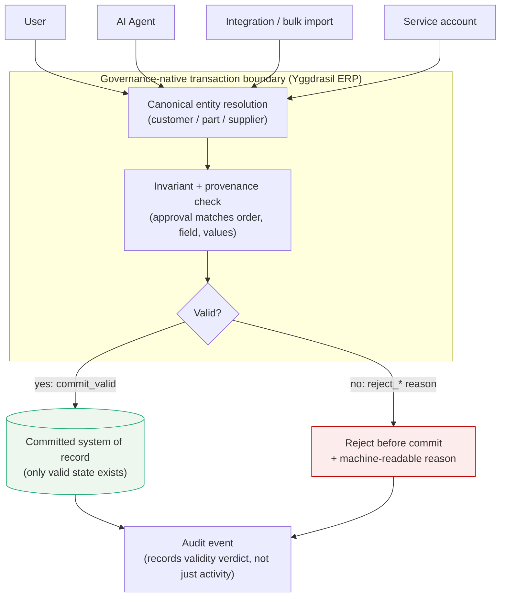

# Governed Write Path

Every caller reaches the system of record through a single governance-native transaction boundary. Canonical validation runs at that boundary. Invalid state is refused before it is persisted, so there is no path — screen, API, import, service account, or agent — that can commit a semantically invalid business fact.

**Read it this way:** the four callers on the left are the same four that bypassed the wrapper in `traditional_wrapper_failure.md`. Here they converge on one boundary. The transactions in `/manifest/rejected_transaction_examples.json` resolve like this: `TX-1` (matched approval) returns `commit_valid`; `TX-2` through `TX-5` return `reject_ambiguous_field`, `reject_missing_provenance`, `reject_alias_collision`, and `reject_missing_provenance` respectively — each refused before persistence, each producing an audit event that records *why*.

The difference from the wrapper model is not more controls. It is one control the callers cannot route around.
