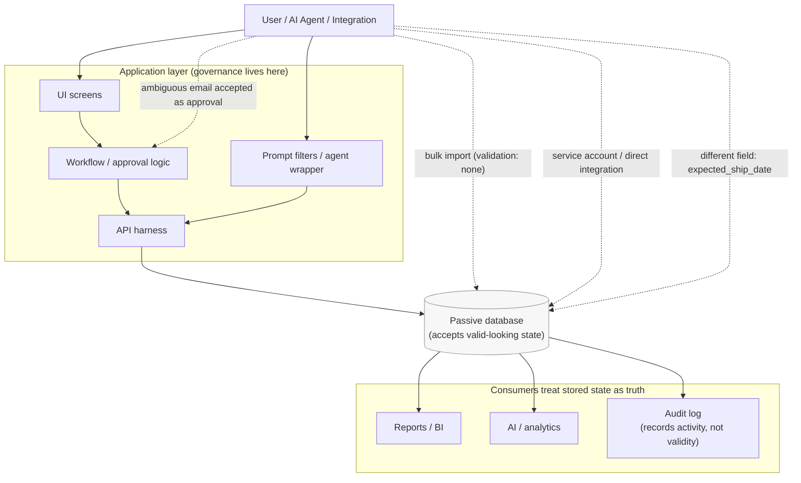

# Traditional Wrapper Failure

Controls live in the application layer (UI, API harness, workflow screens, prompt filters). The database underneath is passive: it accepts whatever well-formed state it is handed. Every path that reaches the database without passing through the guarded screen is an unenforced write.

**Read it this way:** the approval logic in `WF` is real, but it only sits on one path. The dotted lines are the paths in the synthetic dataset that reach the database without enforcement — a bulk import with `validation_mode = none` (`BLK-0203`), a service-account API PATCH (`API-5567`), a change to a *different* date field, and an ambiguous email accepted as approval (`EMAIL-3391`). The audit log faithfully records all of it and judges none of it.

The wrapper is not useless; it is simply not a boundary. A boundary is something all paths must cross.
