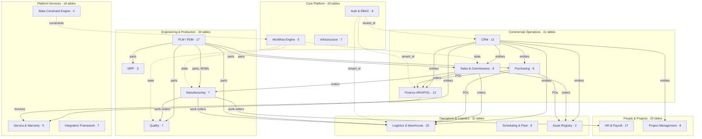

# Mimisbrunnr — Schema Map

> 166 tables · 17 domains · Multi-tenant SaaS · System-Agnostic Universal Schema

## Tables by Domain

| Domain | Tables | Key Tables |
|--------|--------|-----------|
| Auth & RBAC | 8 | tenants, users, tenant_roles, permissions, role_permissions, user_roles, tenant_settings, user_mfa |
| Workflow Engine | 5 | workflow_templates, workflow_steps, workflow_transitions, workflow_instances, workflow_step_instances |
| Infrastructure | 7 | notifications, notification_preferences, attachments, audit_log, form_templates, form_submissions, record_locks |
| CRM | 12 | crm_entities, crm_contacts, crm_addresses, crm_opportunities, crm_leads, crm_interactions, crm_entity_relationships, crm_lead_sources, crm_campaigns, crm_campaign_members, crm_territories, crm_territory_assignments |
| Sales | 8 | sales_quotes, sales_quote_lines, sales_orders, sales_order_lines, sales_commissions, sales_commission_rules, sales_price_lists, sales_price_list_items |
| Purchasing | 8 | finance_purchase_orders, finance_po_lines, purchasing_suppliers, purchasing_receipts, purchasing_receipt_lines, purchasing_rfqs, purchasing_rfis, purchasing_rfps |
| Finance | 13 | finance_accounts, finance_gl_entries, finance_invoices, finance_invoice_lines, finance_payments, finance_payment_applications, finance_bills, finance_currencies, finance_exchange_rates, finance_gain_loss, finance_fiscal_periods, finance_tax_rates, finance_fixed_assets |
| PLM / PDM | 17 | plm_parts, plm_part_revisions, plm_bom_headers, plm_bom_lines, plm_ebom_headers, plm_ebom_lines, plm_ecr, plm_eco, plm_ecn, plm_ecr_parts, plm_routings, plm_routing_operations, plm_where_used, plm_part_suppliers, plm_documents, plm_naics_codes, product_serialization_config |
| Manufacturing | 7 | mfg_work_orders, mfg_work_centers, mfg_operations, mfg_materials, mfg_shop_floor_log, mfg_oee_records, mfg_scrap |
| Quality | 7 | quality_ncr, quality_8d, quality_capa, quality_audits, quality_inspection_plans, quality_complaints, quality_findings |
| MRP | 3 | mrp_run_log, mrp_planned_orders, mrp_demand |
| Logistics | 20 | logistics_inventory, logistics_locations, logistics_transactions, logistics_shipments, logistics_shipment_lines, logistics_carriers, logistics_warehouses, logistics_pick_lists, logistics_pick_items, logistics_cycle_counts, logistics_cycle_count_lines, logistics_returns, logistics_return_lines, logistics_labels, logistics_landed_costs, logistics_putaway_rules, logistics_bins, logistics_lot_tracking, logistics_serial_numbers, logistics_reorder_rules |
| Scheduling & Fleet | 9 | scheduling_assignments, scheduling_shifts, scheduling_calendars, scheduling_exceptions, fleet_vehicles, fleet_maintenance, fleet_assignments, territory_zones, territory_assignments |
| Asset Registry | 2 | asset_registry, asset_ownership_history |
| HR & Payroll | 17 | hr_employees, hr_departments, hr_positions, hr_locations, hr_time_entries, hr_leave_requests, hr_payroll_records, hr_benefits, hr_reviews, hr_goals, hr_training, hr_certifications, hr_pay_grades, hr_tax_withholdings, hr_deductions, hr_benefit_plans, hr_garnishments |
| Project Management | 8 | pm_projects, pm_tasks, pm_phases, pm_issues, pm_budgets, pm_milestones, pm_dependencies, pm_budget_items |
| Service & Warranty | 5 | service_requests, service_rma, service_warranty, service_orders, service_maintenance |
| Integration | 7 | integration_connections, integration_field_mappings, integration_sync_log, integration_conflict_log, integration_webhooks, integration_dead_letters, integration_transforms |
| State Engine | 4 | state_entity_types, state_definitions, state_transitions, state_transition_constraints |
| **Total** | **~166** | |

## Relationship Key

- **Solid arrows** = foreign key data flow (CRM entities → Sales orders → Manufacturing → Logistics → Finance)
- **Dotted arrows** = infrastructure dependencies (Auth tenant scoping, Workflow state management)
- **CRM** and **PLM** are the two hub modules — nearly everything references one or both
- All tables include `tenant_id` with Row-Level Security for complete multi-tenant isolation

---

*Mimir Labs LLC — April 2026*
